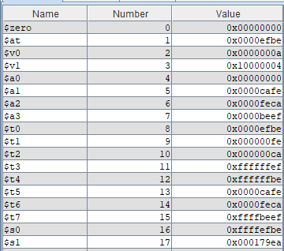

# 仿真实验1
## 执行结果
使用MARS模拟器模拟结果，与实验完成的结果进行对比，验证正确性。
### addiu.x

对addiu指令的模拟是正确的。
### arithtest.x

算术指令操作模拟正确。
### brtest0.x

### brtest1.x

### brtest2.x

分支测试2结果正确。
### memtest0.x

内存测试0结果正确。
### memtest1.x

内存测试1结果正确。

